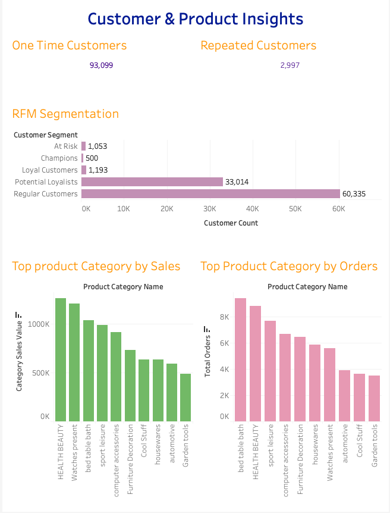
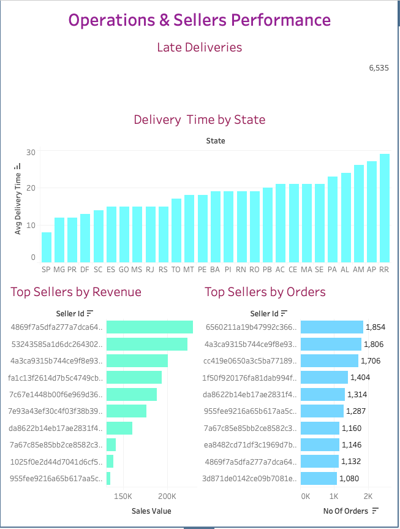

# Target Brazil E-Commerce Analysis

## Project Overview

This project analyzes the Target Brazil E-Commerce dataset using SQL (Google BigQuery) and Tableau to uncover insights into revenue performance, customer behavior, product demand, seller performance, payment preferences, delivery efficiency, and customer segmentation.

The objective is to identify business opportunities, improve customer retention, optimize delivery performance, and provide actionable recommendations through data-driven analysis.

---

## Tools Used

* SQL (Google BigQuery)
* Tableau
* GitHub

---

## Dataset Information

Dataset: Brazilian E-Commerce Public Dataset by Olist

Tables Used:

* Orders
* Customers
* Order Items
* Order Payments
* Products
* Sellers

---

## Business Questions

1. What is the total revenue generated by the business?
2. How has revenue changed over time?
3. Which states contribute the highest revenue?
4. Which product categories generate the most sales?
5. What is the customer retention rate?
6. Which payment methods are most preferred?
7. Which sellers contribute the most revenue?
8. How efficient is the delivery process?
9. Which customer segments are most valuable?

---

# KPI Summary

| KPI                       |      Value |
| ------------------------- | ---------: |
| Total Revenue             |     16.01M |
| Total Orders              |     99,441 |
| Total Customers           |     96,096 |
| Average Order Value (AOV) |     160.99 |
| Average Delivery Time     | 12.09 Days |
| Late Delivery Rate        |      6.57% |

---

# Analysis Performed

## 1. Revenue Analysis

### Analysis

* Monthly Revenue Trend
* Revenue by State
* Revenue Contribution by State

### Key Insights

* November 2017 generated the highest revenue.
* December 2016 generated the lowest revenue.
* São Paulo (SP), Rio de Janeiro (RJ), and Minas Gerais (MG) were the top revenue-contributing states.
* Revenue was highly concentrated among a few major states.

---

## 2. Customer Analysis

### Analysis

* One-Time vs Repeat Customers
* Customer Lifetime Value (CLV)
* Top Customers by Revenue

### Key Insights

* One-time customers dominated the customer base.
* Only 2,997 customers made repeat purchases.
* Average Customer Lifetime Value (CLV) was 166.9.
* Repeat customer contribution presents a significant growth opportunity.

---

## 3. Product Analysis

### Analysis

* Revenue by Product Category
* Orders by Product Category
* Average Product Price by Category

### Key Insights

Top Revenue Generating Categories:

| Category             | Revenue |
| -------------------- | ------: |
| Health Beauty        |   1.26M |
| Watches Present      |   1.21M |
| Bed Table Bath       |   1.04M |
| Sports Leisure       |   0.99M |
| Computer Accessories |   0.91M |

* Health Beauty generated the highest revenue.
* Watches Present ranked second in total revenue.
* Bed Table Bath recorded the highest order volume among top categories.

---

## 4. Payment Analysis

### Analysis

* Revenue by Payment Type
* Payment Method Popularity
* Installments vs Order Value

### Key Insights

* Credit Card was the most preferred payment method.
* Customers frequently used installment-based purchases for higher-value orders.
* Payment preferences significantly influenced purchasing behavior.

---

## 5. Delivery Analysis

### Analysis

* Average Delivery Time
* Delivery Performance by State
* Late Deliveries
* Late Delivery Rate

### Key Insights

* Average delivery time was 12.09 days.
* São Paulo (SP) had the fastest delivery performance.
* Roraima (RR) had the slowest delivery performance.
* 6.57% of orders were delivered after the estimated delivery date.

---

## 6. Seller Performance Analysis

### Analysis

* Top Sellers by Revenue
* Top Sellers by Order Volume
* Seller Delivery Performance
* Seller Late Delivery Rate

### Key Insights

* Revenue was concentrated among a small group of sellers.
* Top-performing sellers generated significantly higher revenue than the marketplace average.
* Seller performance varied across delivery efficiency metrics.

---

## 7. RFM Customer Segmentation

RFM Analysis was performed using:

* Recency
* Frequency
* Monetary Value

### Customer Segments

| Segment             | Customers |
| ------------------- | --------: |
| Regular Customers   |    60,335 |
| Potential Loyalists |    33,014 |
| Loyal Customers     |     1,193 |
| At Risk             |     1,053 |
| Champions           |       500 |

### Key Insights

* The majority of customers belong to the Regular Customer segment.
* Potential Loyalists represent a large opportunity for future growth.
* Champions are high-value customers and should be prioritized for retention.
* At-Risk customers require targeted re-engagement campaigns.

---

# Tableau Dashboards

## Dashboard 1: Executive Overview

* Total Revenue
* Total Orders
* Total Customers
* Average Order Value
* Average Delivery Time
* Monthly Revenue Trend
* Revenue by State
* Revenue by Payment Type

## Dashboard 2: Customer & Product Insights

* One-Time vs Repeat Customers
* RFM Segment Distribution
* Top Product Categories by Revenue
* Top Product Categories by Orders

## Dashboard 3: Operations & Seller Performance

* Delivery Time by State
* Late Delivery Rate
* Top Sellers by Revenue
* Top Sellers by Orders

---

# Business Recommendations

### Customer Retention

* Implement loyalty programs for Champions and Loyal Customers.
* Use personalized promotions to convert Potential Loyalists into repeat buyers.
* Launch win-back campaigns for At-Risk customers.

### Product Strategy

* Increase focus on high-performing categories such as Health Beauty and Watches Present.
* Expand inventory in categories with strong demand and revenue potential.

### Operational Improvements

* Improve delivery efficiency in slower-performing states.
* Monitor and reduce late deliveries to improve customer satisfaction.

### Seller Management

* Identify best practices from top-performing sellers.
* Create performance benchmarks and incentive programs for sellers.

---

# Project Outcome

This project demonstrates end-to-end data analytics skills including:

* Data Exploration
* SQL Querying
* KPI Analysis
* Revenue Analysis
* Customer Analytics
* Product Analytics
* Seller Performance Analysis
* Delivery Performance Analysis
* RFM Segmentation
* Business Recommendations
* Tableau Dashboard Development

The analysis provides actionable insights to support customer retention, operational efficiency, and revenue growth strategies.

---

## Dashboard Screenshots

### Executive Overview Dashboard

target_sql_ecommerce_analysis
/dashboard_1_target_brazil_ecommerce_analysis.png

### Customer & Product Insights Dashboard

### Operations & Seller Performance Dashboard

---

**Sandhya Sriram**

Aspiring Data Analyst | SQL | BigQuery | Tableau | Business Intelligence
